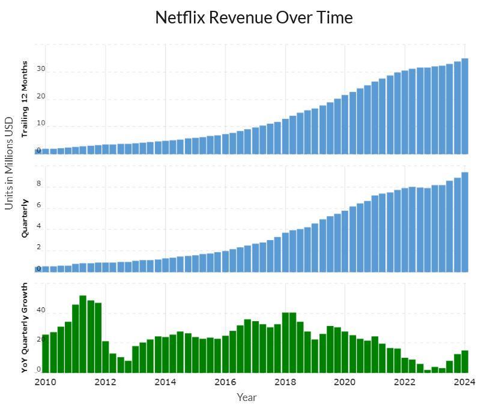
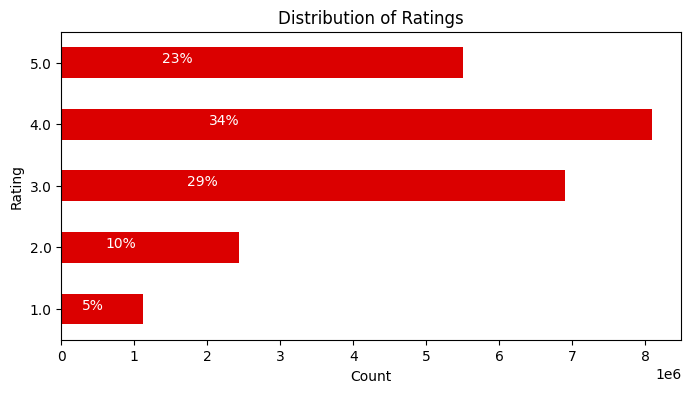
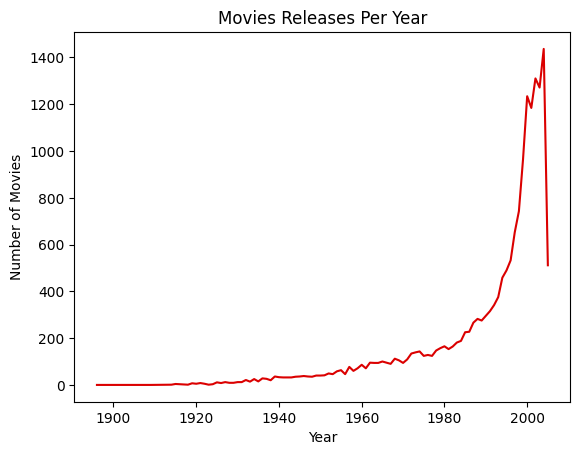
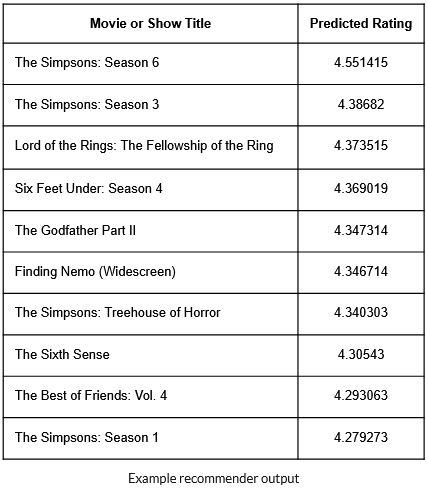

## Artificial Neural Network: Movie Recommender
* Goal: Create a movie or TV show recommendation system utilizing Netflix data.
* Results: Artificial neural network was successful with a root mean squared error of 0.91.

### Summary :speaker:
* Background
* Exploratory Data Analysis
* Models
* Results
* Next Steps

  

### Background 
* In June 2024, Netflix was one of the largest media companies in the world and had a revenue of 9.56 billion dollars.
* Netflix believes it could lose 1 billion dollars every year without their recommendation engine.
* Netflix creates original content from their recommendation engine with 93% of their original content being renewed.

  

### The Data :bar_chart:
* The Netflix competition data was used.
* For computational power purposes, 24 million data points were used (1/4 of the entire dataset)
https://www.kaggle.com/datasets/netflix-inc/netflix-prize-data

### Exploratory Data Analysis :paperclip: 
- [x] Features include user ID, movie title, and user rating
- [x] Movie titles had bad data that required formatting while importing
- [x] Removed 4499 missing rating rows
- [x] Reviewed distribution of ratings
- [x] Plotted movie releases per year

  

  

### Data Modeling :bar_chart:
* Used Keras neural network
* Created two models
* 2 layers, Adam optimizer
* 3 layers, SGD optimizer
* Used root mean squared error as main metric
* Adam optimizer gave an RMSE of 0.91 

  

### Applications:
This model can be utilized by entertainment companies to recommend movies, TV shows, books, or other media to customers.

### Next steps:
* Utilize the entire data set for the model
* Try other methods for recommendations, such as cosine similarity for movie descriptions

 

